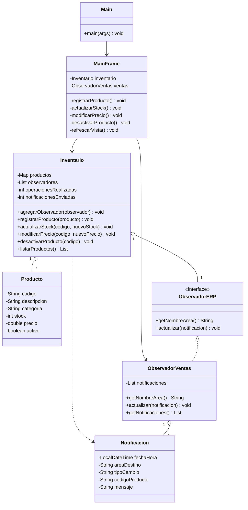

# Diagrama de Clases

```mermaid
classDiagram
    class Main {
        +main(args) void
    }

    class MainFrame {
        -Inventario inventario
        -ObservadorVentas ventas
        -registrarProducto() void
        -actualizarStock() void
        -modificarPrecio() void
        -desactivarProducto() void
        -refrescarVista() void
    }

    class Inventario {
        -Map productos
        -List observadores
        -int operacionesRealizadas
        -int notificacionesEnviadas
        +agregarObservador(observador) void
        +registrarProducto(producto) void
        +actualizarStock(codigo, nuevoStock) void
        +modificarPrecio(codigo, nuevoPrecio) void
        +desactivarProducto(codigo) void
        +listarProductos() List
    }

    class Producto {
        -String codigo
        -String descripcion
        -String categoria
        -int stock
        -double precio
        -boolean activo
    }

    class Notificacion {
        -LocalDateTime fechaHora
        -String areaDestino
        -String tipoCambio
        -String codigoProducto
        -String mensaje
    }

    class ObservadorERP {
        <<interface>>
        +getNombreArea() String
        +actualizar(notificacion) void
    }

    class ObservadorVentas {
        -List notificaciones
        +getNombreArea() String
        +actualizar(notificacion) void
        +getNotificaciones() List
    }

    Main --> MainFrame
    MainFrame --> Inventario
    MainFrame --> ObservadorVentas
    Inventario "1" o-- "*" Producto
    Inventario "1" o-- "1" ObservadorERP
    ObservadorERP <|.. ObservadorVentas
    Inventario ..> Notificacion
    ObservadorVentas "1" o-- "*" Notificacion
```

