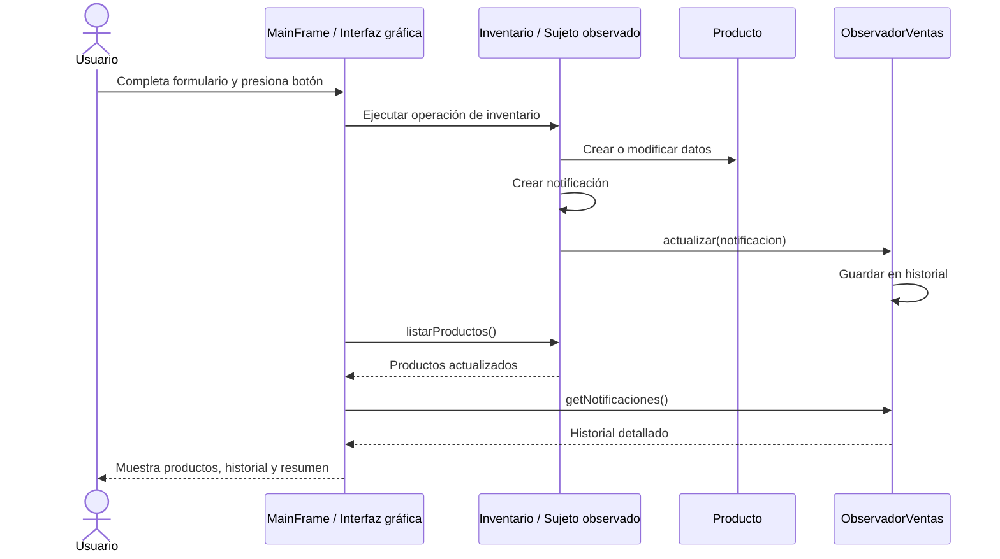

# Diagrama de Secuencia a Nivel de Diseño

```mermaid
sequenceDiagram
    actor Usuario
    participant UI as MainFrame / Interfaz gráfica
    participant Inventario as Inventario / Sujeto observado
    participant Producto as Producto
    participant Ventas as ObservadorVentas

    Usuario->>UI: Completa formulario y presiona botón
    UI->>Inventario: Ejecutar operación de inventario
    Inventario->>Producto: Crear o modificar datos
    Inventario->>Inventario: Crear notificación
    Inventario->>Ventas: actualizar(notificacion)
    Ventas->>Ventas: Guardar en historial
    UI->>Inventario: listarProductos()
    Inventario-->>UI: Productos actualizados
    UI->>Ventas: getNotificaciones()
    Ventas-->>UI: Historial detallado
    UI-->>Usuario: Muestra productos, historial y resumen
```

